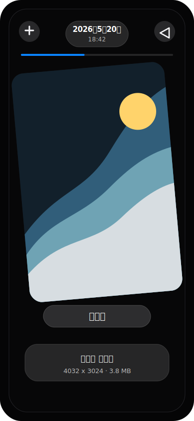
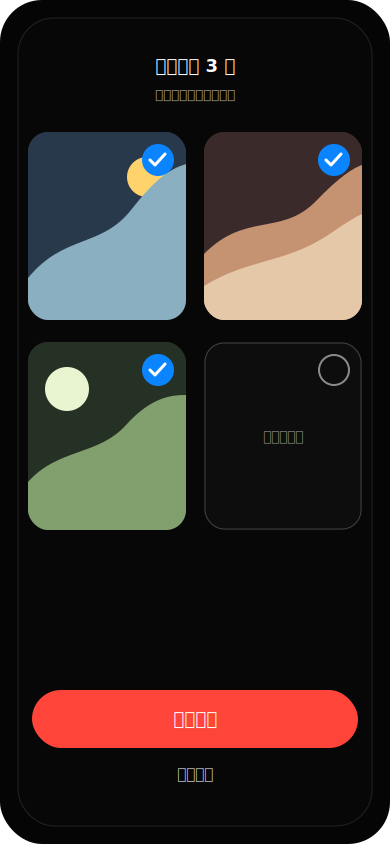
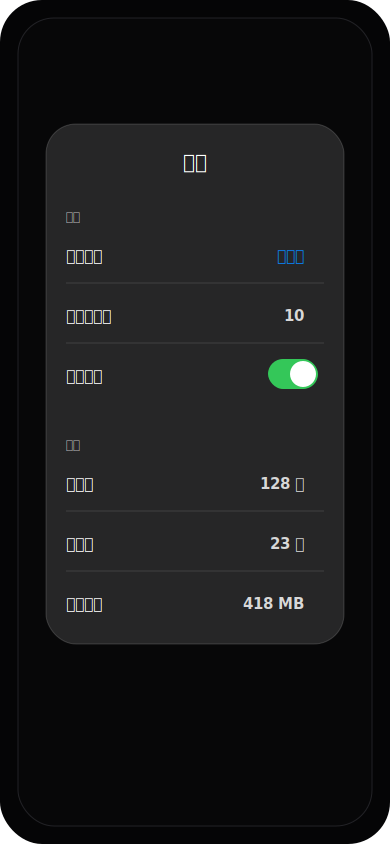
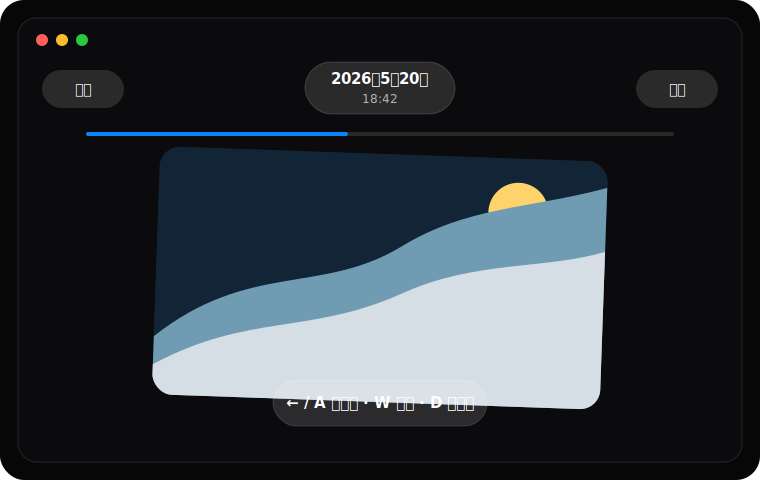

<div align="center">
  
  <h1>PhotoLite</h1>
  <p>一个本地优先、手势驱动的照片筛选和清理 App。</p>
  <p>
    <a href="README.en.md">English</a>
    ·
    <a href="https://github.com/songjack152/PhotoLite/releases/tag/v1.0.0">下载 1.0.0</a>
    ·
    <a href="docs/INSTALL.md">安装说明</a>
    ·
    <a href="docs/PRIVACY.md">隐私说明</a>
  </p>
  <p>
    
    
    
    
  </p>
</div>

## 简介

PhotoLite 用来快速整理照片库。它会把照片随机分组，用户通过手势逐张筛选：左滑下一张，右滑上一张，上滑标记删除。每一组结束后，App 会进入二次确认页；只有用户再次确认后，才会真正执行删除。

这个项目适合：

- 想快速清理大量照片的人。
- 想要本地处理、不上传照片的用户。
- 想参考照片权限、手势交互、多平台 Flutter / SwiftUI 实现的开发者。

## 截图

以下为示例截图，不包含真实用户照片。

<p>
  
  
  
</p>

<p>
  
</p>

## 下载和版本

最新版本：`1.0.0`

| 平台 | 安装方式 | 状态 |
| --- | --- | --- |
| Android | 下载 `PhotoLite-Android-preview.apk` | 已提供预览版 |
| macOS | 下载 `PhotoLite-macOS-release.dmg` | 已提供预览版 |
| iPhone | Xcode 本机运行，后续可走 TestFlight / App Store | 源码可用 |
| Windows | 下载 `PhotoLite-Windows-release.zip` | 已提供预览版 |

下载地址：

[PhotoLite 1.0.0 Release](https://github.com/songjack152/PhotoLite/releases/tag/v1.0.0)

更详细的安装步骤见 [docs/INSTALL.md](docs/INSTALL.md)。

## 核心功能

- 按组筛选照片，默认每组 10 张。
- 左滑下一张，右滑上一张，上滑标记删除。
- 删除前必须经过二次确认。
- 二次确认页可以单独取消某张照片的删除选择。
- 展示照片日期、分辨率、文件大小和可用的地点信息。
- 支持按照片时间范围优先筛选，例如近一个月、近三个月、近半年、近一年、近五年。
- 支持移动端震动反馈。
- macOS / Windows 版支持方向键和 WASD 操作。
- 本地优先，没有后端服务。

## 删除安全设计

PhotoLite 的核心原则是避免误删：

1. 手势只负责筛选，不会直接删除照片。
2. 上滑只是把照片加入“待删除”列表。
3. 每组结束后必须进入二次确认页。
4. 用户可以在确认页取消单张照片的删除选择。
5. 最终删除通过系统能力或本地文件流程执行。

建议在清理重要照片前保留外部备份。

## 隐私

PhotoLite 是本地优先工具：

- 不上传照片、缩略图、EXIF 或位置信息。
- 没有后端服务。
- 照片元数据只用于本地展示和筛选。
- 仓库不包含签名证书、Provisioning Profile、keystore、本地构建产物、APK、DMG 或 Archive。

详细说明见 [docs/PRIVACY.md](docs/PRIVACY.md)。

## 项目结构

```text
PhotoSwipeCleaner.xcodeproj       原生 iPhone SwiftUI 工程
PhotoSwipeCleaner/                iOS 原生版源码
photolite_flutter/                Android、macOS、Windows Flutter 版
docs/                             安装、隐私和发布说明
scripts/                          本地打包脚本
```

## 从源码构建

### iPhone 原生版

环境要求：

- macOS
- Xcode
- 如需分发到设备、TestFlight 或 App Store，需要 Apple Developer 账号

```bash
open PhotoSwipeCleaner.xcodeproj
```

然后在 Xcode 中选择真机运行，或通过 Product > Archive 准备 TestFlight / App Store 上传。

### Flutter 版

环境要求：

- Flutter SDK
- Android Studio 和 Android SDK，用于 Android 构建
- Xcode，用于 macOS / iOS 相关 Flutter 构建

```bash
cd photolite_flutter
flutter pub get
flutter run
```

构建 Android：

```bash
flutter build apk --debug
flutter build apk --release
```

构建 macOS：

```bash
flutter build macos --release
```

构建 Windows：

```powershell
flutter build windows --release
```

项目脚本：

```bash
./scripts/build_flutter_android_apk.sh
./scripts/build_flutter_macos_dmg.sh
```

Windows 打包脚本需要在 Windows PowerShell 中运行：

```powershell
.\scripts\build_flutter_windows_zip.ps1
```

正式发布所需的签名材料不会提交到仓库。请在仓库外配置自己的 Android keystore、Apple Team、Developer ID 证书或商店托管签名。

## AI 协作开发

PhotoLite 采用 AI 协作开发完成。产品方向、交互细节和测试反馈来自用户，代码实现、界面迭代、发布文档整理和安全检查由 AI 辅助完成。

项目仍然遵循正常工程流程：本地构建、真机测试、权限检查、删除流程二次确认、发布前敏感信息扫描。

## 文档

- [安装说明](docs/INSTALL.md)
- [隐私说明](docs/PRIVACY.md)
- [TestFlight 发布清单](docs/TESTFLIGHT_RELEASE.md)
- [跨平台发布说明](docs/MULTIPLATFORM_RELEASE.md)
- [贡献指南](CONTRIBUTING.md)

## 贡献

欢迎通过 issue 或 pull request 参与改进。提交前请优先确认：

- 不提交本地照片、测试素材或隐私数据。
- 不提交签名证书、keystore、Provisioning Profile 或 `.env`。
- 涉及删除流程的改动必须保留二次确认。

## 许可证

PhotoLite 使用 [MIT License](LICENSE)。
